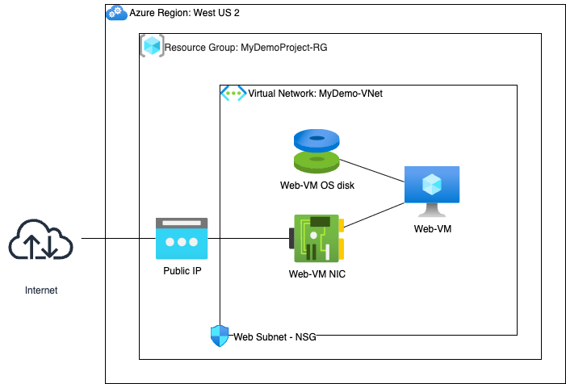
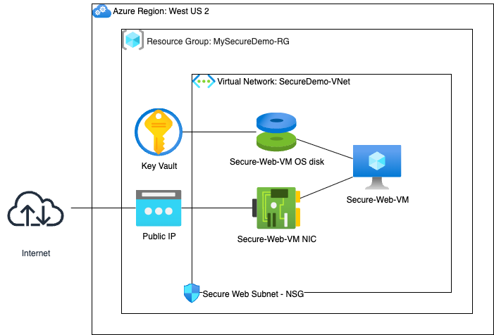
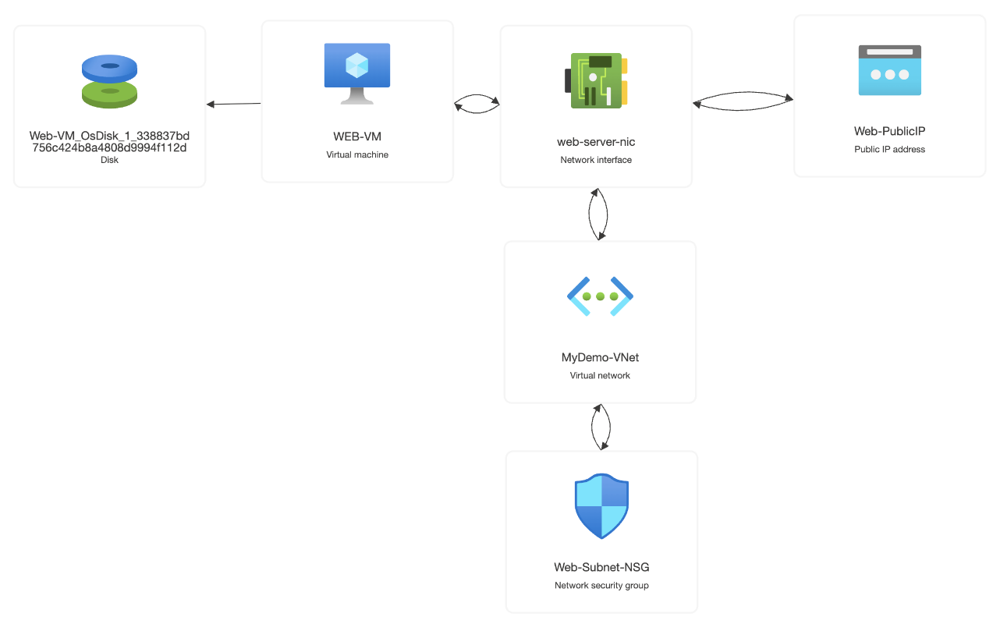

# Azure Administrator Demo - Deployment

## Project Overview

This project simulates the creation of a secure, production-ready cloud foundation for a hypothetical startup. The goal is to deploy a core set of Azure resources using Infrastructure as Code (IaC), with a primary focus on implementing security best practices from day one.

This repository showcases advanced skills in Azure administration, security hardening, automation, and real-world problem-solving.

### IaC Tooling: A Demonstration of Adaptability

This repository intentionally contains **two distinct methods** for deploying the same target architecture:

1.  **Terraform:** The initial implementation. This is included to demonstrate proficiency in Terraform.
2.  **Azure CLI & PowerShell Script:** The implementation with secure configuration.

During development, several complex issues arose with the Terraform provider's handling of specific security resources and state management. The decision to pivot to a combined Azure CLI/PowerShell script demonstrates a critical engineering skill: **diagnosing complex tool-specific issues and adapting to a more direct and reliable solution to meet project requirements.**

---

##  Architecture

Inital infrastructure deployed by the Terraform.



Secure infrastructure deployed by Azure CLI & PowerShell Script.



## Demostration 1: Using Terraform

### Skills & Features Demonstrated

This project showcases the following Azure and DevOps competencies:

*   **Infrastructure as Code (IaC):** All resources are defined declaratively using **Terraform**.
*   **Core Networking:**
    *   Creation of a **Virtual Network (VNet)** to provide an isolated network environment.
    *   Segmentation using **Subnets** for organizing resources.
*   **Network Security:**
    *   Implementation of a **Network Security Group (NSG)**.
    *   Configuration of an inbound security rule to allow **RDP access** for administration.
*   **Compute:**
    *   Deployment of a **Windows Server Virtual Machine**.
*   **Public IP & Connectivity:**
    *   Allocation of a **Standard SKU Public IP address** for external access.
*   **Resource Management:**
    *   Logical grouping of all resources within a single **Resource Group**.

### Technologies Used

*   **Microsoft Azure**
*   **Terraform**
*   **Azure CLI**

### How to Deploy

#### Prerequisites

1.  **Azure CLI:** You must have the Azure CLI installed.
2.  **Terraform:** You must have Terraform installed.
3.  **Azure Subscription:** An active Azure subscription.

#### Deployment Steps

1.  **Configure main.tf file for the project:**

    [main.tf](main.tf)

2.  **Log in to Azure:**
    ```bash
    az login
    ```

3.  **Initialize Terraform:**
    This command downloads the necessary Azure provider plugin.
    ```bash
    terraform init
    ```

4.  **Plan the deployment:**
    This command shows you a preview of the resources that will be created.
    ```bash
    terraform plan
    ```

5.  **Apply the configuration:**
    This command builds the infrastructure. Type `yes` when prompted.
    ```bash
    terraform apply
    ```

#### Deployed Resources

After running `terraform apply`, the following key resources will be created in the Azure subscription:

*   A Resource Group named `MyDemoProject-RG`.
*   A Virtual Network named `MyDemo-VNet`.
*   A Network Security Group named `Web-Subnet-NSG` with a rule to allow RDP.
*   A Windows Server Virtual Machine named `Web-VM`.
*   A Disk named `Web-VM-OsDisk` associated with `Web-VM`
*   A Network Interface.
*   A Standard Public IP address.



#### Connecting to the VM

1.  After the `terraform apply` command completes, it will output the public IP address of the server.
2.  Use a Remote Desktop client to connect to this IP address.
3.  **Username:** `azureadmin`
4.  **Password:** The password you set in the `main.tf` file.

#### Cleanup

Run the following command to delete everything created by this project:
```bash
terraform destroy
```

---

## Demostration 2: Using Azure CLI & PowerShell Script

### Skills & Features Demonstrated

Advanced security measures applied on the infrastructure.

### Security by Design

This project implements a "Defense in Depth" strategy, addressing key recommendations from **Microsoft Defender for Cloud**.

*   **Principle of Least Privilege:**
    *   The VM is granted a specific role (`Key Vault Crypto Service Encryption User`) on the Key Vault, giving it only the permissions it needs to enable encryption and nothing more.

*   **Minimized Attack Surface:**
    *   **Just-In-Time (JIT) VM Access:** The RDP port (3389) is closed by default. Access is granted on-demand for a limited time through Microsoft Defender, eliminating a common vector for brute-force attacks.

*   **Data Protection:**
    *   **Azure Disk Encryption:** The OS disk of the VM is encrypted at rest, protecting the data even if the underlying storage is compromised.

*   **Continuous Monitoring:**
    *   **Microsoft Defender for Cloud:** The script programmatically enables Defender plans for CSPM and Virtual Machines to ensure ongoing security posture monitoring and threat detection.

---

### Deployment & Verification

#### How to Deploy (Azure CLI Script)

1.  **Prerequisites:**
    *   Azure CLI
    *   PowerShell (`pwsh`)
    *   Azure PowerShell Modules (`Az`)

2. **Configure the script:**
   [deploy-secure-infra.sh](deploy-secure-infra.sh)

2.  **Make the script executable:** `chmod +x deploy-secure-infra.sh`
3.  **Run the script:** `./deploy-secure-infra.sh`

#### Deployed Resources

After running `./deploy-secure-infra.sh`, the following key resources will be created in the Azure subscription:

*   A Resource Group named `MySecureDemo-RG`.
*   A Virtual Network named `Secure-VNet`.
*   A Network Security Group named `Secure-Web-Subnet-NSG`.
*   A Key Vault name `kv-sec-demo-<unique_identifier>`
*   A Windows Server Virtual Machine named `Secure-Web-VM`.
*   A Disk named `Secure-Web-VM-OsDisk` associated with `Secure-Web-VM`
*   A Network Interface.
*   A Standard Public IP address.


#### How to Verify Security

*   **Verify JIT Access:**
    1.  In the Azure Portal, navigate to the `Secure-Web-VM`.
    2.  Click on **Connect**. You will see that a standard RDP connection is blocked.
    3.  You must click **"Request access"** under the Just-in-time access section to open the port temporarily.

*   **Verify Disk Encryption:**
    1.  Navigate to the `Secure-Web-VM`.
    2.  In the left menu, under "Settings", click on **Disks**.
    3.  You will see that the "Encryption" status for the OS Disk is **"SSE with PMK & ADE"** (Azure Disk Encryption).

---

### Future Improvements

*   **CI/CD Pipeline:** Integrate this script into a GitHub Actions or Azure DevOps pipeline for automated deployments.
*   **Granular NSG Rules:** Add more specific Network Security Group rules to restrict outbound traffic.
*   **Monitoring & Alerting:** Configure Azure Monitor to collect metrics and logs, and set up alerts for performance or security events.

### Cleanup

Run the following command to delete the entire resource group:
```bash
az group delete --name MySecureDemo-RG --yes --no-wait
```
